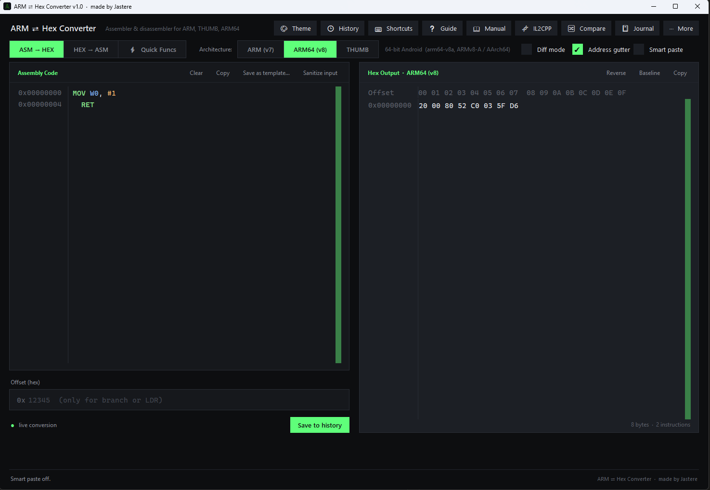
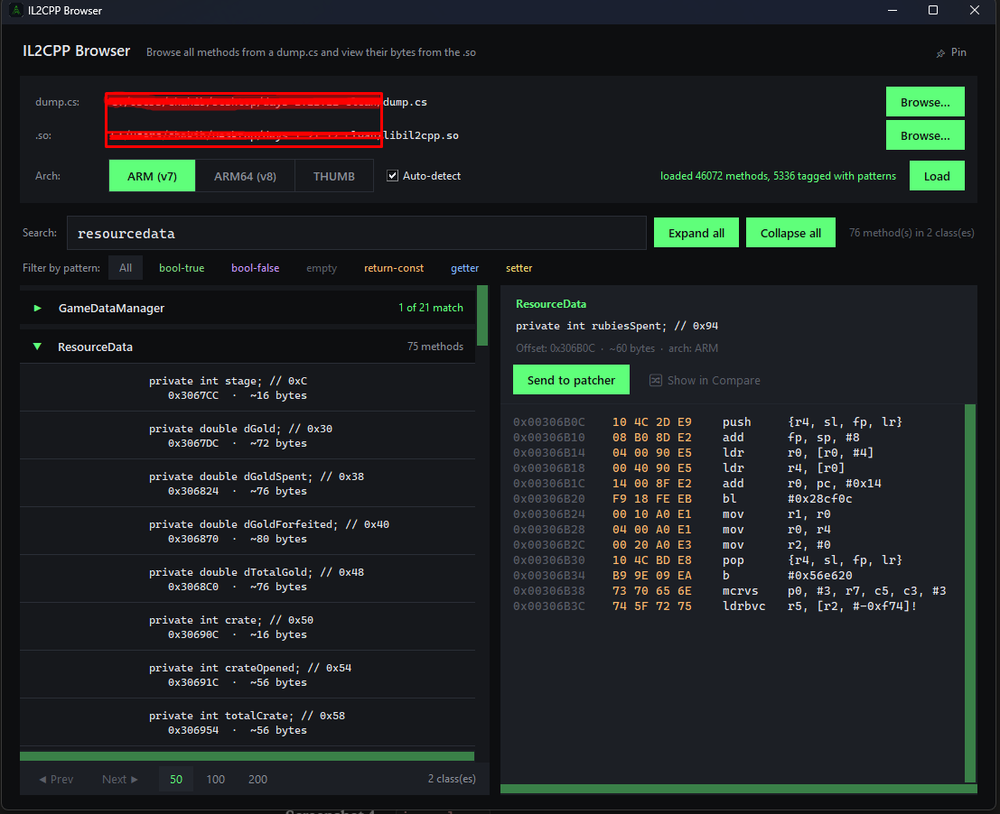
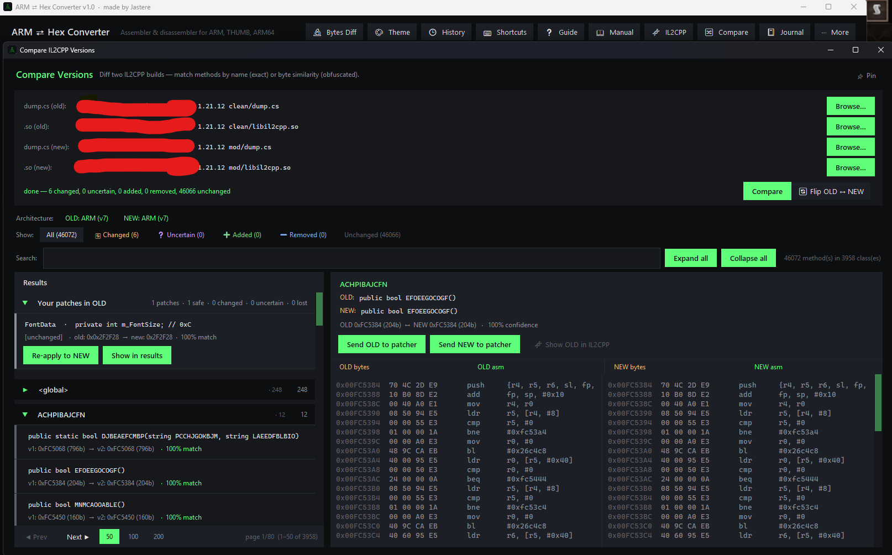
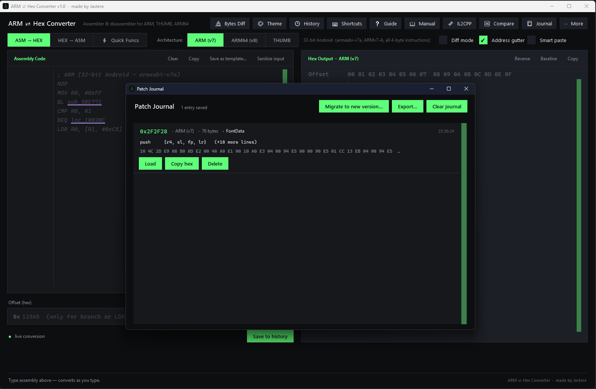

# ARM ⇄ Hex Converter

A desktop tool for **Android binary modding** — convert ARM/ARM64/THUMB assembly to and from hex bytes, browse IL2CPP method dumps, diff binaries across game versions, and manage patches.

Built for reverse engineers, IL2CPP modders, and anyone working with `libil2cpp.so` files.

Made by **Jastere**.

---

## Download

**Latest version:** see [Releases](../../releases/latest)

1. Download `ARM-Hex-Converter-vX.Y.Z.zip` from the latest release
2. Extract the zip anywhere (Desktop, a folder, anywhere you like)
3. Open the extracted folder
4. Double-click `arm_converter.exe`

No installation required, no Python needed. To uninstall, just delete the folder.

---

## What it does

- **ARM ⇄ Hex Converter** — paste assembly, get bytes. Paste bytes, get assembly. ARM v7, ARM64 v8, and THUMB all supported.
- **🧬 IL2CPP Browser** — load `dump.cs` + `libil2cpp.so` together. Browse classes, search methods, see disassembly, send any method directly into the patcher.
- **🔀 Compare versions** — diff two game versions. Find which methods changed, moved, or were added/removed across an update.
- **📓 Patch Journal** — every patch you make is auto-logged with class/method context. Review past work, copy hex, export.
- **📓 Migrate to new version** — when the game updates, find your existing patches' new offsets automatically using byte-fingerprint matching.
- **⚡ Quick Funcs** — pre-baked one-click patches for `return TRUE`, `return FALSE`, `return INT`, `return FLOAT`, etc.
- **📋 Templates** — common patch patterns (`force return true`, `skip integrity check`) in one click.
- **✓ Verify, 🔬 Bytes Diff, 📖 Manual, ❓ Guide, 🎨 Themes** — supporting tools.

See [TOOLS.md](TOOLS.md) for the full feature reference.

---

## Screenshots

### Main converter
   

   ### IL2CPP browser
   

   ### Compare versions
   

   ### Patch journal
   

---

## Quick start

1. Download the latest `.exe` from Releases.
2. Run it.
3. To convert assembly: pick architecture, type into the input panel, copy the output.
4. To mod a game: click `🧬 IL2CPP`, load your `dump.cs` and `libil2cpp.so`, find a method, click `Send to patcher`, write your patch.
5. When the game updates: open `📓 Journal` → `Migrate to new version` → pick the new files → done.

---

## Requirements

- **Windows 10 or later** (the tool uses Windows-specific APIs for dark titlebar and DPI scaling)
- No Python install needed — everything is bundled in the .exe

---

## ⚠ Antivirus notes

The .exe is compiled with [Nuitka](https://nuitka.net/), which translates Python to C and produces a real native Windows binary. Some antivirus engines occasionally flag any compiled-Python tool as suspicious due to generic ML heuristics — this is a known industry-wide issue with packaged Python applications, not specific to this tool.

If your antivirus flags the download:

https://www.virustotal.com/gui/file/9191319b085dff1c80f0f1e743f795bd8487b8daef5f1bb926a42af823a3ea72?nocache=1

9191319b085dff1c80f0f1e743f795bd8487b8daef5f1bb926a42af823a3ea72

1. **Verify the SHA-256 hash** matches the one published on the Releases page (verifies the file you downloaded is the file I built)
2. **Submit to VirusTotal** at https://www.virustotal.com/ — most major engines (Kaspersky, BitDefender, ESET, Avast, AVG, McAfee, Sophos, Trend Micro, Malwarebytes, etc.) clear the binary
3. **Add an exclusion** if you trust the file after verifying

Each release page includes both the zip hash and the inner `.exe` hash so you can verify either the download or what's inside it.

---

## How to extract `dump.cs` and `libil2cpp.so` for an Android game

This tool reads files that another tool produces. You'll need:

- **APK Extractor** (or just rename `.apk` → `.zip` and unzip) to get `libil2cpp.so` from `lib/arm64-v8a/` or `lib/armeabi-v7a/`
- **[Il2CppDumper](https://github.com/Perfare/Il2CppDumper)** to produce `dump.cs` from the .so + global-metadata.dat

Once you have both files, this tool takes over.

---

## Honest limitations

- **Windows only.** Other platforms aren't supported (the dark titlebar and DPI APIs are Win32-specific).
- **No THUMB cross-references.** The IL2CPP cross-reference index supports ARM and ARM64. THUMB is rarely used for IL2CPP-generated code on Android.
- **Patch migration is a heuristic.** Byte-fingerprint matching finds ~95% of patches across typical game updates. Heavily refactored methods may need manual review.
- **Not a debugger or auto-patcher.** This tool produces hex bytes for you to apply with a hex editor, then rebuild the APK with `apktool` / `zipalign` / `jarsigner`.

---

## Reporting bugs

Open an issue on this repo with:
1. Tool version (shown in the title bar)
2. What you were doing
3. What happened vs what you expected
4. If applicable: contents of `%APPDATA%/ARMHexConverter/crash.log`

I read every issue. Response times vary.

---

## Feature requests

Open an issue tagged `enhancement`. Be specific about your workflow — "add feature X" is less helpful than "I'm trying to do Y and currently I have to do Z, which is painful." Workflow context lets me design the right thing.

---

## License

**Closed source. Free to use; no redistribution allowed.**

See [LICENSE](LICENSE) for the full terms.

Built using [Keystone Engine](https://www.keystone-engine.org/) (LGPL) and [Capstone Engine](https://www.capstone-engine.org/) (BSD), bundled in the .exe.

---

## Credits

- **Keystone Engine** — assembler backend (LGPL, project at https://www.keystone-engine.org/)
- **Capstone Engine** — disassembler backend (BSD, project at https://www.capstone-engine.org/)
- **Jastere** — everything else

---

*This tool exists for legitimate research, education, and personal modding of software you own. Don't use it to violate Terms of Service of games you don't own, distribute pirated content, or attack systems you don't have permission to access.*
